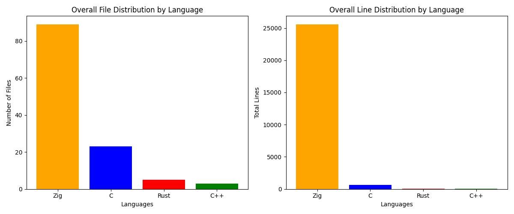

# Zig Unleashed 
## A Comprehensive Guide to Robust and Optimal Programming 

> In this repository, you will find code samples for each chapter of the book. 
> The book mentions the name of each file, which corresponds to the respective file in this repository.

### Chapters  
- [Chapter 01: Introduction](https://github.com/MKProj/ZigUnleashed/tree/main/ch01)  
- [Chapter 02: The Basics](https://github.com/MKProj/ZigUnleashed/tree/main/ch02)  
- [Chapter 03: Functions](https://github.com/MKProj/ZigUnleashed/tree/main/ch03)  
- [Chapter 04: Arrays and Slices](https://github.com/MKProj/ZigUnleashed/tree/main/ch04)  
- [Chapter 05: Struct, Enums and Unions](https://github.com/MKProj/ZigUnleashed/tree/main/ch05)  
- [Chapter 06: Pointers and Memory Management](https://github.com/MKProj/ZigUnleashed/tree/main/ch06)  
- [Chapter 09: Advance Topics](https://github.com/MKProj/ZigUnleashed/tree/main/ch09)  
---
## Software Requirements
It is recommended to use a `linux` operating system as we use `Makefile` extensively throughout this repository, however, you may use `Windows` (recommended to use `zig cc/c++` as the `C/C++` compiler respectively). 

Required: 
- `zig`: `v0.11.0`
- `rustc`: `> v1.63`
- `clang/gcc`: `v13.0.0/v11.4.0`
- `g++`: `v11.4.0`
- `make`: `v4.3`

For `ch09`'s cross-compilation you will need the following if you would like to target the Raspberry Pi 4: 

Dependencies:
```shell 
$ sudo apt install gcc-arm-linux-gnueabihf binutils-arm-linux-gnueabihf binutils-arm-linux-gnueabihf-dbg qemu-user
```

Rust target: `rustup target add armv7-unknown-linux-gnueabihf`
  
---


# Statistics

## File and Line Distribution



## Table

| Language   |   Number of Files |   Total Lines | Percentage of Total Files   | Percentage of Total Lines   |
|------------|-------------------|---------------|-----------------------------|-----------------------------|
| Zig        |                85 |          3801 | 81.73%                      | 90.33%                      |
| Rust       |                 4 |            31 | 3.85%                       | 0.74%                       |
| C          |                13 |           323 | 12.50%                      | 7.68%                       |
| C++        |                 2 |            53 | 1.92%                       | 1.26%                       |